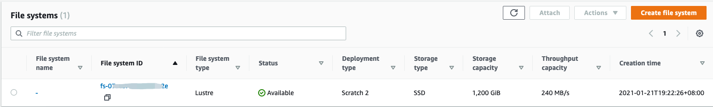

# Deploying Stateful Microservices with Amazon FSx Lustre

Amazon FSx for Lustre is a fully managed service that provides cost-effective, high-performance storage for compute workloads. FSx for Lustre offers sub-millisecond latencies, up to hundreds of gigabytes per second of throughput, and millions of IOPS.

[Deploying Stateful Microservices with Amazon FSx Lustre](https://www.eksworkshop.com/beginner/190_fsx_lustre/)

[Amazon FSx for Lustre CSI driver](https://docs.aws.amazon.com/eks/latest/userguide/fsx-csi.html)

## Setup the variables
```bash
AWS_REGION=cn-northwest-1
ACCOUNT_ID=$(aws sts get-caller-identity --query "Account" --output text --region $AWS_REGION)
CLUSTER_NAME=eksworkshop
VPC_ID=$(aws eks describe-cluster --name $CLUSTER_NAME --query "cluster.resourcesVpcConfig.vpcId" --output text --region $AWS_REGION)
SUBNET_ID=$(aws eks describe-cluster --name $CLUSTER_NAME --query "cluster.resourcesVpcConfig.subnetIds[0]" --output text --region $AWS_REGION)
SECURITY_GROUP_ID=$(aws eks describe-cluster --name $CLUSTER_NAME --query "cluster.resourcesVpcConfig.securityGroupIds" --output text --region $AWS_REGION)
CIDR_BLOCK=$(aws ec2 describe-vpcs --vpc-ids $VPC_ID --query "Vpcs[].CidrBlock" --output text --region $AWS_REGION)
S3_LOGS_BUCKET=eks-fsx-lustre-$(cat /dev/urandom | LC_ALL=C tr -dc "[:alpha:]" | tr '[:upper:]' '[:lower:]' | head -c 32)
SECURITY_GROUP_ID=$(aws eks describe-cluster --name $CLUSTER_NAME --query "cluster.resourcesVpcConfig.clusterSecurityGroupId" --output text --region $AWS_REGION)
```

## To deploy the Amazon FSx for Lustre CSI driver to an Amazon EKS cluster
1. Create an AWS Identity and Access Management OIDC provider and associate it with your cluster.
```bash
eksctl utils associate-iam-oidc-provider \
    --region $AWS_REGION \
    --cluster $CLUSTER_NAME \
    --approve
```

2. Create an IAM policy and service account that allows the driver to make calls to AWS APIs on your behalf.
```bash
cat << EOF >  fsx-csi-driver.json
{
    "Version":"2012-10-17",
    "Statement":[
        {
            "Effect":"Allow",
            "Action":[
                "iam:CreateServiceLinkedRole",
                "iam:AttachRolePolicy",
                "iam:PutRolePolicy"
            ],
            "Resource":"arn:aws-cn:iam::*:role/aws-service-role/s3.data-source.lustre.fsx.amazonaws.com/*"
        },
        {
            "Action":"iam:CreateServiceLinkedRole",
            "Effect":"Allow",
            "Resource":"*",
            "Condition":{
                "StringLike":{
                    "iam:AWSServiceName":[
                        "fsx.amazonaws.com"
                    ]
                }
            }
        },
        {
            "Effect":"Allow",
            "Action":[
                "s3:ListBucket",
                "fsx:CreateFileSystem",
                "fsx:DeleteFileSystem",
                "fsx:DescribeFileSystems"
            ],
            "Resource":[
                "*"
            ]
        }
    ]
}
EOF
```

3. Create the policy.
```
aws iam create-policy \
    --policy-name Amazon_FSx_Lustre_CSI_Driver \
    --policy-document file://fsx-csi-driver.json \
    --region $AWS_REGION
```

4. Create a Kubernetes service account for the driver and attach the policy to the service account.
```bash
eksctl create iamserviceaccount \
    --region $AWS_REGION \
    --name fsx-csi-controller-sa \
    --namespace kube-system \
    --cluster $CLUSTER_NAME \
    --attach-policy-arn arn:aws-cn:iam::$ACCOUNT_ID:policy/Amazon_FSx_Lustre_CSI_Driver \
    --approve --override-existing-serviceaccounts
```

5. Save the Role ARN
```bash
export ROLE_ARN=$(aws cloudformation describe-stacks --stack-name eksctl-eksworkshop-addon-iamserviceaccount-kube-system-fsx-csi-controller-sa --query "Stacks[0].Outputs[0].OutputValue" --output text --region $AWS_REGION)
```

6. Deploy the aws-fsx-csi-driver
```bash
kubectl apply -k "github.com/kubernetes-sigs/aws-fsx-csi-driver/deploy/kubernetes/overlays/stable/?ref=master"

kubectl get pods -n kube-system
NAME                                            READY   STATUS    RESTARTS   AGE
...
fsx-csi-controller-55bcb55d5d-hkn4p             2/2     Running   0          8d
fsx-csi-controller-55bcb55d5d-whff2             2/2     Running   0          8d
fsx-csi-node-8hqmk                              3/3     Running   0          8d
fsx-csi-node-v9zsw                              3/3     Running   0          8d
....
```

7. Patch the driver deployment to add the service account
```bash
kubectl annotate serviceaccount -n kube-system fsx-csi-controller-sa \
 eks.amazonaws.com/role-arn=$ROLE_ARN --overwrite=true

kubectl get pods -n kube-system
```

## Deploying the Stateful service to use the Amazon FSx

1. Deploy a Kubernetes storage class, persistent volume claim, and sample application to verify that the CSI driver is working
```bash
# 1. Create an Amazon S3 bucket
aws s3 mb s3://$S3_LOGS_BUCKET --region $AWS_REGION
echo test-file >> testfile
aws s3 cp testfile s3://$S3_LOGS_BUCKET/export/testfile --region $AWS_REGION

# 2. Edit Security group
aws ec2 authorize-security-group-ingress --group-id ${SECURITY_GROUP_ID} --protocol tcp --port 988 --cidr 192.168.0.0/16 --region $AWS_REGION
```

2. Create the storageclass definition

If you only want to import data and read it without any modification and creation, then you don't need a value for `s3ExportPath` in your storageclass.yaml file.

```bash
cat << EOF > storageclass.yaml
---
kind: StorageClass
apiVersion: storage.k8s.io/v1
metadata:
    name: fsx-sc
provisioner: fsx.csi.aws.com
parameters:
    subnetId: ${SUBNET_ID}
    securityGroupIds: ${SECURITY_GROUP_ID}
    s3ImportPath: s3://${S3_LOGS_BUCKET}
    s3ExportPath: s3://${S3_LOGS_BUCKET}/export
    deploymentType: SCRATCH_2
mountOptions:
    - flock
EOF

kubectl apply -f storageclass.yaml
kubectl get pv
```

3. Persistent volume claim
- Download the persistent volume claim manifest
    ```bash
    curl -o claim.yaml https://raw.githubusercontent.com/kubernetes-sigs/aws-fsx-csi-driver/master/examples/kubernetes/dynamic_provisioning_s3/specs/claim.yaml
    ```

- Edit the claim.yaml file. 
Change the following <value> to one of the increment values listed below, based on your storage requirements and the deploymentType that you selected in a previous step.
    ```bash
    storage: <1200Gi>

    SCRATCH_2 and PERSISTENT – 1.2 TiB, 2.4 TiB, or increments of 2.4 TiB over 2.4 TiB.

    SCRATCH_1 – 1.2 TiB, 2.4 TiB, 3.6 TiB, or increments of 3.6 TiB over 3.6 TiB.
    ```

- Create the persistent volume claim.
    ```
    kubectl apply -f claim.yaml
    ```
- Confirm that the file system is provisioned.
```bash
kubectl get pvc
kubectl get persistentvolumeclaims fsx-claim -w

NAME        STATUS   VOLUME                                     CAPACITY   ACCESS MODES   STORAGECLASS   AGE
fsx-claim   Bound    pvc-fe62a8c9-7c96-49fd-a495-e8ca725b6571   1200Gi     RWX            fsx-sc         9m10s
```

The `STATUS` may show as `Pending` for 5-10 minutes, before changing to `Bound`. Don't continue with the next step until the `STATUS` is `Bound`.

Check the FSx console, you can find new created FSx Lustre file system


## Deploy the sample application.
1. Prepare the example YAML file
```bash
cat >test-pod.yaml <<EOF
apiVersion: v1
kind: Pod
metadata:
  name: fsx-app
spec:
  containers:
  - name: app
    image: centos
    command: ["/bin/sh"]
    args: ["-c", "while true; do echo \"hello from FSx\" >> /data/out.txt; sleep 5; done"]
    volumeMounts:
    - name: persistent-storage
      mountPath: /data
  nodeSelector:
    kubernetes.io/os: linux
    kubernetes.io/arch: amd64
  volumes:
  - name: persistent-storage
    persistentVolumeClaim:
      claimName: fsx-claim
EOF
```

2. Deploy application
```bash
kubectl apply -f test-pod.yaml

kubectl get pods
NAME             READY   STATUS    RESTARTS   AGE
fsx-app          1/1     Running   0          6m33s


kubectl describe pod fsx-app
Events:
  Type    Reason     Age   From               Message
  ----    ------     ----  ----               -------
  Normal  Scheduled  57s   default-scheduler  Successfully assigned default/sample-fsx-app to ip-192-168-72-134.cn-northwest-1.compute.internal
  Normal  Pulling    56s   kubelet            Pulling image "048912060910.dkr.ecr.cn-northwest-1.amazonaws.com.cn/dockerhub/amazonlinux:2"
  Normal  Pulled     52s   kubelet            Successfully pulled image "048912060910.dkr.ecr.cn-northwest-1.amazonaws.com.cn/dockerhub/amazonlinux:2"
  Normal  Created    51s   kubelet            Created container app
  Normal  Started    51s   kubelet            Started container app

# kubectl logs should no error or exception
kubectl logs fsx-app -f
```

3. Check the result
```bash
kubectl exec -ti fsx-app -- tail -f /data/out.txt
hello from FSx
hello from FSx
```

4. Sample 2, using amazonlinux
```bash
curl -o sample-pod.yaml https://raw.githubusercontent.com/kubernetes-sigs/aws-fsx-csi-driver/master/examples/kubernetes/dynamic_provisioning_s3/specs/pod.yaml

# If you mix the windows and linux node group, you need modify the sample-pod.yaml to add the nodeSelector under spec
  nodeSelector:
    kubernetes.io/os: linux
    kubernetes.io/arch: amd64

kubectl apply -f sample-pod.yaml

kubectl get pods
NAME             READY   STATUS    RESTARTS   AGE
fsx-app          1/1     Running   0          6m33s
sample-fsx-app   1/1     Running   0          3m55s


kubectl describe pod sample-fsx-app
Events:
  Type    Reason     Age    From               Message
  ----    ------     ----   ----               -------
  Normal  Scheduled  3m43s  default-scheduler  Successfully assigned default/fsx-app to ip-192-168-72-134.cn-northwest-1.compute.internal
  Normal  Pulling    3m41s  kubelet            Pulling image "048912060910.dkr.ecr.cn-northwest-1.amazonaws.com.cn/dockerhub/centos"
  Normal  Pulled     3m37s  kubelet            Successfully pulled image "048912060910.dkr.ecr.cn-northwest-1.amazonaws.com.cn/dockerhub/centos"
  Normal  Created    3m36s  kubelet            Created container app
  Normal  Started    3m36s  kubelet            Started container app

# kubectl logs should no error or exception
kubectl logs fsx-app -f

kubectl exec -ti fsx-app -- tail -f /data/out.txt
```

5. Troubleshooting
- FSX CSI drivers don't support windows at the moment.
- Make sure the aws-node pod is running on your kubernetes nodes
```bash
kubectl get pods -o wide --all-namespaces | grep aws-node
```
- Make sure aws-node and fsx-csi-node are in READY and AVAILABLE status
```bash
kubectl get daemonset --all-namespaces
```
- Make sure aws-node, fsx-csi-controller and fsx-csi-node pods are running on the node
```bash
kubectl describe node <YOUR LINUX NODE>
```        

## Access Amazon S3 files from the Amazon FSx for Lustre file system
1. Verify that data was written to the Amazon FSx for Lustre file system by the sample app. 
```bash
kubectl exec -it sample-fsx-app ls /data
export  out.txt
```

2. Archive files to the s3ExportPath
- Export the file `/data/out.txt` back to Amazon S3.
```bash
kubectl exec -ti sample-fsx-app -- lfs hsm_archive /data/out.txt
# Should no error or exception
```

- Confirm that the out.txt file was written to the s3ExportPath folder in Amazon S3 
```bash
aws s3api list-buckets | grep eks-fsx-lustre
export S3_LOGS_BUCKET=

aws s3 ls s3://$S3_LOGS_BUCKET/export/ --region cn-northwest-1 
2021-01-29 18:22:34      57005 out.txt
2021-01-20 22:54:29         10 testfile
```

## Cleanup
```bash
kubectl delete -f test-pod.yaml
kubectl delete -f sample-pod.yaml
kubectl delete -f claim.yaml
kubectl delete -f storageclass.yaml
kubectl delete -k "github.com/kubernetes-sigs/aws-fsx-csi-driver/deploy/kubernetes/overlays/stable/?ref=master"

aws s3 rm --recursive s3://$S3_LOGS_BUCKET
aws s3 rb  s3://$S3_LOGS_BUCKET

eksctl delete iamserviceaccount \
    --region $AWS_REGION \
    --name fsx-csi-controller-sa \
    --namespace kube-system \
    --cluster $CLUSTER_NAME

aws iam delete-policy \
    --policy-arn arn:aws:iam::$ACCOUNT_ID:policy/Amazon_FSx_Lustre_CSI_Driver
```

## Reference
[Storage Classes](https://kubernetes.io/docs/concepts/storage/storage-classes/)

[Persistent Volumes](https://kubernetes.io/docs/concepts/storage/persistent-volumes/)

[Using the FSx for Lustre CSI Driver with Amazon EKS](https://aws.amazon.com/blogs/opensource/using-fsx-lustre-csi-driver-amazon-eks/)

[Using Amazon FSx for Windows File Server on EKS Windows Containers](https://aws.amazon.com/blogs/containers/using-amazon-fsx-for-windows-file-server-on-eks-windows-containers/)