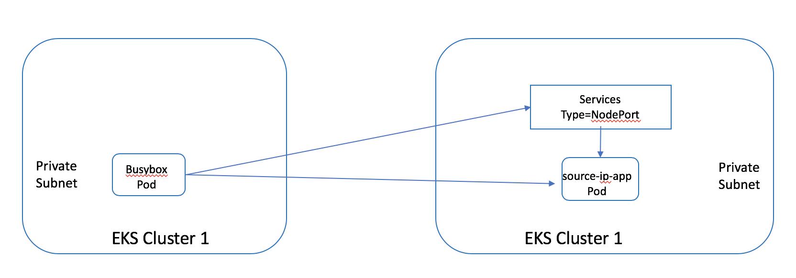
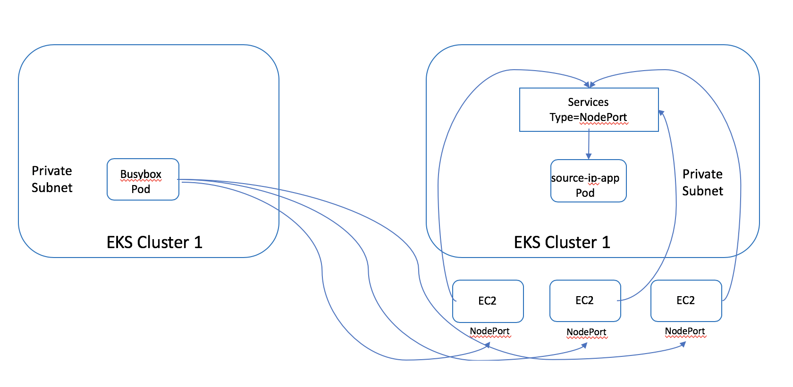
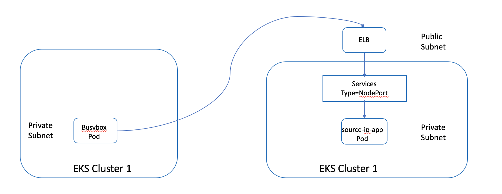
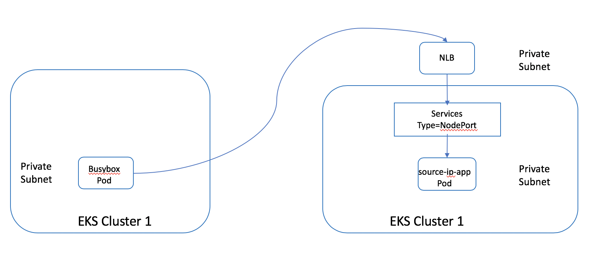
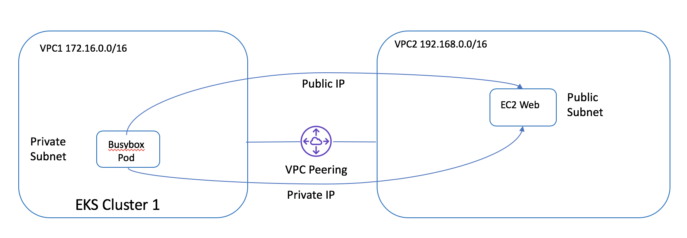

# 步骤12 探索不同ServiceExpose类型下Pod到Service的通信以及VPCPeering的支持

- [Service expose 类型 官方文档](https://kubernetes.io/docs/tutorials/services/source-ip/)
- [External SNAT 官方文档](https://docs.aws.amazon.com/eks/latest/userguide/external-snat.html/)
- [AWS-VPC-CNI 插件官方文档](https://github.com/aws/amazon-vpc-cni-k8s)

> 本节目的
1. 探索 Service expose 类型 ClusterIP, NodePort, LoadBalancer 访问的source ip
2. 学习EKS集群如何进行VPC Peering (类似方法同样适用于通过Direct Connect连接数据中心或者其他AWS Region）


# 12.1 创建 Worker Node 在Private Subnet的集群
复用已经创建的VPC (172.16.0.0/16)，创建Worker Node 位于Private Subnet的集群

注意：如果要创建面向公网的ELB，则群集中必须具有私有子网和公用子网。 如果只有私有子网，则必须通过注释声明您的 ELB 是内部的：service.beta.kubernetes.io/aws-load-balancer-internal: "true" 。
否则，您将遇到错误：
CreatingLoadBalancerFailed   service/{Service_NAME} Error creating load balancer (will retry): failed to ensure load balancer for service {Service_NAME}: could not find any suitable subnets for creating the ELB

[参考eksctl文档](https://eksctl.io/usage/vpc-networking/)
## 创建集群
```bash
# 参考 resource/private-cluster.yaml, 修改subnets
eksctl create cluster -f resource/private-cluster.yaml

# 多个EKS集群进行上下文切换, 确保位于gcr-eksworkshop-private
kubectl config get-contexts
kubectl config use-context <YOUR_TARGET_CONTEXT>

# 集群创建完毕后,查看EKS集群工作节点，由于位于 Private Subent 未分配EXTERNAL-IP
kubectl get nodes -o jsonpath='{range .items[*]}{"NAME: "}{@.metadata.name}{"    INTERNAL-IP: "}{@.status.addresses[?(@.type=="InternalIP")].address}{"    EXTERNAL-IP: "}{@.status.addresses[?(@.type=="ExternalIP")].address}{"\n"}{end}'
# 输出
NAME: ip-172-16-150-17.cn-northwest-1.compute.internal    INTERNAL-IP: 172.16.150.17    EXTERNAL-IP: 
NAME: ip-172-16-167-227.cn-northwest-1.compute.internal    INTERNAL-IP: 172.16.167.227    EXTERNAL-IP: 
NAME: ip-172-16-212-54.cn-northwest-1.compute.internal    INTERNAL-IP: 172.16.212.54    EXTERNAL-IP: 

# 部署测试 nginx, pod 位于私有子网， Service 暴露为 Type=LoadBalancer，位于公有子网
kubectl apply -f resource/nginx-app/nginx-nlb.yaml
## Check deployment status
kubectl get pods

## Get the external access 确保 EXTERNAL-IP是一个有效的AWS Network Load Balancer的地址
NLB=$(kubectl get service service-nginx -o json | jq -r '.status.loadBalancer.ingress[].hostname')
curl -m3 -v $NLB

## 清理
kubectl delete -f resource/nginx-app/nginx-nlb.yaml
```

# 12.2 探索 不同 Service Type 情况下 Pod 到 Service 访问的连通性和源IP
1. 部署示例应用程序，程序回显接收到请求的源IP
```bash
kubectl create deployment source-ip-app --image=k8s.gcr.io/echoserver:1.4

SOURCE_IP_APP=$(kubectl get pods | egrep -o "source-ip-app[a-zA-Z0-9-]+")
kubectl get pod ${SOURCE_IP_APP} -o json | jq -r '.status | "HOST IP: " + .hostIP + " , POD IP: " + .podIP'
# 样例输出为 HOST IP: 172.16.150.17 , POD IP: 172.16.131.88
# 设置变量
SOURCE_IP_APP_HOSTIP=172.16.150.17
SOURCE_IP_APP_PODIP=172.16.131.88
```
2. 在同一个 EKS 集群启动一个 busybox 容器，测试 Pod 到 Pod 私有地址访问
```bash
# 检查看是否存在一个 busybox 容器
BUSY_BOX=$(kubectl get pods | egrep -o "busybox[a-zA-Z0-9-]+")
echo ${BUSY_BOX}
# 如果 ${BUSY_BOX} 不为空，进入已有的 busybox 容器的交互式模式
kubectl attach ${BUSY_BOX} -c busybox -it
# 如果 ${BUSY_BOX} 为空，重新创建一个 busybox
kubectl run busybox -it --image=busybox -- /bin/sh
# 在另一个命令行窗口获取 busybox 的 IP 地址
kubectl get pod ${BUSY_BOX} -o json | jq -r '.status | "HOST IP: " + .hostIP + " , POD IP: " + .podIP'
# 样例输出为 HOST IP: 172.16.212.54 , POD IP: 172.16.205.58
# 设置变量
BUSY_BOX_HOSTIP=172.16.212.54
BUSY_BOX_PODIP=172.16.205.58
```

## 12.2.1 Client Pod 到 Service 私有地址访问
### 发布服务为 Type=ClusterIP



1. 为 source-ip-app 发布一个 Type=ClusterIP 的服务
```bash
kubectl expose deployment source-ip-app --name=clusterip --port=80 --target-port=8080
TestClusterIP=$(kubectl get svc clusterip -o json | jq -r '.spec.clusterIP')
echo ${TestClusterIP}
```
2. 进入 busybox 访问 source-ip-app

    发现 source-ip-app 输出 
- client_address={BUSY_BOX_PODIP}
- request_uri=http://{SOURCE_IP_APP_PODIP}:8080/
- host={SOURCE_IP_APP_PODIP}:8080
```bash
# 直接访问 source-ip-app Pod，替换 {SOURCE_IP_APP_PODIP} 为之前的变量 SOURCE_IP_APP_PODIP
wget -qO - {SOURCE_IP_APP_PODIP}:8080 | egrep -i 'client_address|host|request_uri'
```

3. 进入 busybox 访问 source-ip-app 暴露的服务，

    发现 source-ip-app 输出 
- client_address={BUSY_BOX_PODIP}
- request_uri=http://{TestClusterIP}:8080/
- host={TestClusterIP}
```bash
# 访问source-ip-app 暴露的服务，替换 {TestClusterIP} 为之前的变量 TestClusterIP
wget -qO - {TestClusterIP} | egrep -i 'client_address|host|request_uri'
```

### 发布服务为 Type=NodePort



1. 发布服务为 Type=NodePort, 设置 Pod 所在的 Node 的安全组的入站规则允许 {NodePort} 访问
```bash
kubectl expose deployment source-ip-app --name=nodeport --port=80 --target-port=8080 --type=NodePort

# 获取 Node IP and Node Port, 设置安全组入站规则
NODEPORT=$(kubectl get -o jsonpath="{.spec.ports[0].nodePort}" services nodeport)
echo ${NODEPORT}
NODES_INTERNAL_IP=$(kubectl get nodes -o jsonpath='{ $.items[*].status.addresses[?(@.type=="InternalIP")].address }')
echo ${NODES_INTERNAL_IP}
VPC_ID=$(aws eks describe-cluster --name ${CLUSTER_NAME} --region ${AWS_REGION} --query "cluster.resourcesVpcConfig.vpcId" --output text)
VPC_CIDR=$(aws ec2 describe-vpcs --vpc-ids ${VPC_ID} --query "Vpcs[].CidrBlock"  --region ${AWS_REGION} --output text)
STACK_NAME=$(eksctl get nodegroup --cluster ${CLUSTER_NAME} --region=${AWS_REGION} -o json | jq -r '.[].StackName')
SGGroupID=$(aws ec2 describe-security-groups --filters Name=tag:Name,Values=${STACK_NAME}\* Name=tag:aws:cloudformation:stack-name,Values=${STACK_NAME} --query "SecurityGroups[*].{SGGroupID:GroupId}" --region=${AWS_REGION} --output text)
aws ec2 authorize-security-group-ingress --group-id ${SGGroupID}  --protocol tcp --port ${NODEPORT} --cidr ${VPC_CIDR} --region=${AWS_REGION}
```
2. 进入 busybox 访问 source-ip-app

    发现 source-ip-app 输出 
- client_address={NodeIP}
- request_uri=http://{NodeIP}:8080/
- host={NodeIP}:{NODEPORT}
```bash
# 访问 source-ip-app Type=NodePort 的服务, 替换 {NODES_INTERNAL_IP} 为之前的变量 NODES_INTERNAL_IP 数组 以及 {NODEPORT} 为之前的变量 NODEPORT
for node in {NODES_INTERNAL_IP}; do wget -qO - $node:{NODEPORT} | egrep -i 'client_address|host|request_uri'; done
# 示例: for node in 172.16.150.17 172.16.167.227 172.16.212.54; do wget -qO - $node:32227 | egrep -i 'client_address|host|request_uri'; done
```

3. 测试完毕，取消安全组入站规则
```bash
aws ec2 revoke-security-group-ingress --group-id ${SGGroupID} --protocol tcp --port ${NODEPORT} --cidr ${VPC_CIDR} --region=${AWS_REGION}
```

### 发布服务为 Type=LoadBalancer



1. 发布服务为 Type=LoadBalancer
```bash
kubectl expose deployment source-ip-app --name=loadbalancer --port=80 --target-port=8080 --type=LoadBalancer
SOURCE_IP_ELB=$(kubectl get service loadbalancer -o json | jq -r '.status.loadBalancer.ingress[].hostname')
echo ${SOURCE_IP_ELB}
```
2. 进入 busybox 访问 source-ip-app

访问 source-ip-app 输出：
- client_address={NODES_INTERNAL_IP} 数组
- request_uri=http://{SOURCE_IP_ELB}:8080/
- host={SOURCE_IP_ELB}

```bash
# 访问 source-ip-app Type=LoadBalancer 的服务, 替换 {SOURCE_IP_ELB} 为之前的变量 SOURCE_IP_ELB
wget -qO - <SOURCE_IP_ELB> | egrep -i 'client_address|host|request_uri'
```

### 发布服务为 内部 AWS NLB



1. 发布服务为 内部 AWS NLB
```bash
kubectl apply -f resource/pod2service/source-ip-app-internal-nlb.yaml
INTERNAL_NLB=$(kubectl get service source-ip-app-internal-nlb -o json | jq -r '.status.loadBalancer.ingress[].hostname')
echo ${INTERNAL_NLB}
```
2. 进入 busybox 访问 source-ip-app

访问 source-ip-app 输出：
- client_address={NODES_INTERNAL_IP} 数组
- request_uri=http://{INTERNAL_NLB}:8080/
- host={INTERNAL_NLB}

```bash
# 访问 source-ip-app Type=LoadBalancer 的服务, 替换 {INTERNAL_NLB} 为之前的变量 INTERNAL_NLB
wget -qO - <INTERNAL_NLB> | egrep -i 'client_address|host|request_uri'
```

# 12.3 探索 不同 Service Type 情况下 Pod 与 VPC Peering 的对端节点互访
## 12.3.1 Pod 访问 VPC Peering 对端 EC2 节点
### 准备活动
1. 本实验创建的 EKS 集群 gcr-eksworkshop-private 所在 VPC1 (172.16.0.0/16)，VPC Peering 的对方 VPC2 (192.168.0.0/16)
2. 创建好 VPC1 (172.16.0.0/16) 与 VPC2 (192.168.0.0/16) 的 VPC Peering 以及 配置好子网的路由表。[VPC Peering 官方文档](https://docs.aws.amazon.com/vpc/latest/peering/working-with-vpc-peering.html)
3. 在 VPC2 (192.168.0.0/16) 中启动一台 运行 Amazon Linux 2 的 EC2，并且运行一个简单的web 程序
```bash
sudo yum -y install httpd
sudo mkdir -p /var/www/html/
hostname=$(curl http://169.254.169.254/latest/meta-data/hostname)
sudo sh -c "echo '<html><h1>Hello From Your Web Server on ${hostname}</h1></html>' > /var/www/html/index.html"
sudo chkconfig httpd on
sudo systemctl start httpd
```
5. 在 VPC2 (192.168.0.0/16) 中 同时运行着 EKS 集群 gcr-zhy-eksworkshop

### 在 VPC1 (172.16.0.0/16) 的 EKS 集群 gcr-eksworkshop-private 的 busybox 访问 VPC2 (192.168.0.0/16) 的 EC2 的 web 服务



进入 busybox 访问 EC2 的 web 服务，**可以访问成功**
```bash
# 访问 EC2 公网IP，可以正确输出响应
/ # wget -qO - <EC2_PUBLIC_IP> 
# 访问 EC2 私网IP，可以正确输出响应
/ # wget -qO - <EC2_PRIVATE_IP> 
```

## 12.3.2 VPC Peering 对端 EC2 节点访问 Pod

1. 设置安全组入站规则允许 VPC Peering 对端 EC2 访问 {NODEPORT}, 80, 8080, 443 端口
```bash
# Service Type=NodePort
NODEPORT=$(kubectl get -o jsonpath="{.spec.ports[0].nodePort}" services nodeport)
echo ${NODEPORT}

PEERING_VPC_CIDR=192.168.0.0/16
STACK_NAME=$(eksctl get nodegroup --cluster ${CLUSTER_NAME} --region=${AWS_REGION} -o json | jq -r '.[].StackName')
SGGroupID=$(aws ec2 describe-security-groups --filters Name=tag:Name,Values=${STACK_NAME}\* Name=tag:aws:cloudformation:stack-name,Values=${STACK_NAME} --query "SecurityGroups[*].{SGGroupID:GroupId}" --region=${AWS_REGION} --output text)
aws ec2 authorize-security-group-ingress --group-id ${SGGroupID}  --protocol tcp --port ${NODEPORT} --cidr ${PEERING_VPC_CIDR} --region=${AWS_REGION}
aws ec2 authorize-security-group-ingress --group-id ${SGGroupID}  --protocol tcp --port 80 --cidr ${PEERING_VPC_CIDR} --region=${AWS_REGION}
aws ec2 authorize-security-group-ingress --group-id ${SGGroupID}  --protocol tcp --port 8080 --cidr ${PEERING_VPC_CIDR} --region=${AWS_REGION}
aws ec2 authorize-security-group-ingress --group-id ${SGGroupID}  --protocol tcp --port 443 --cidr ${PEERING_VPC_CIDR} --region=${AWS_REGION}
```

2. 登录 VPC2 (192.168.0.0/16) 中一台EC2，访问 12.2.1 创建的 Type=ClusterIP 服务，验证能否访问成功
```bash
# 直接访问 source-ip-app Pod，替换 {SOURCE_IP_APP_PODIP} 为之前的变量 SOURCE_IP_APP_PODIP
wget -qO - {SOURCE_IP_APP_PODIP}:8080 | egrep -i 'client_address|host|request_uri'
输出：
    - client_address={EC2_IP}
    - request_uri=http://{SOURCE_IP_APP_PODIP}:8080/
    - host={SOURCE_IP_APP_PODIP}:8080
# 访问source-ip-app 暴露的服务，替换 {TestClusterIP} 为之前的变量 TestClusterIP
wget -qO - {TestClusterIP} | egrep -i 'client_address|host|request_uri'
输出：
    网络不通, ClusterIP 仅为Cluster内部通信
```

3. 登录 VPC2 (192.168.0.0/16) 中一台EC2，访问 12.2.1 创建的 Type=NodePort 服务，验证访问成功
```bash
# 访问 source-ip-app Type=NodePort 的服务, 替换 {NODES_INTERNAL_IP} 为之前的变量 NODES_INTERNAL_IP 数组 以及 {NODEPORT} 为之前的变量 NODEPORT
for node in {NODES_INTERNAL_IP}; do wget -qO - $node:{NODEPORT} | egrep -i 'client_address|host|request_uri'; done
输出：
    client_address={node}
    request_uri=http://{node}:8080/
    host={node}:{NODEPORT}
```

4. 登录 VPC2 (192.168.0.0/16) 中一台EC2，访问 12.2.1 创建的 Type=LoadBalancer 服务，验证能否访问成功
```bash
# 访问 source-ip-app Type=LoadBalancer 的服务, 替换 {SOURCE_IP_ELB} 为之前的变量 SOURCE_IP_ELB
wget -qO - {SOURCE_IP_ELB} | egrep -i 'client_address|host|request_uri'
输出：
    client_address={EC2_IP}
    request_uri=http://{SOURCE_IP_ELB}:8080/
    host={SOURCE_IP_ELB}

# 访问 source-ip-app Type=LoadBalancer 的服务, 替换 {INTERNAL_NLB} 为之前的变量 INTERNAL_NLB
wget -qO - {INTERNAL_NLB} | egrep -i 'client_address|host|request_uri'
输出：
    client_address={EC2_IP}
    request_uri=http://{INTERNAL_NLB}:8080/
    host={INTERNAL_NLB}
```

## 12.3.3 VPC Peering 对端 EKS cluster Pod 节点访问 本地 EKS cluster Pod
1. 在 VPC2 (192.168.0.0/16) 中的 EKS 集群 gcr-zhy-eksworkshop 启动一个 busybox
```bash
# 创建一个 busybox
kubectl run busybox -it --image=busybox -- /bin/sh
# 在另一个命令行窗口获取 busybox 的 IP 地址
BUSY_BOX=$(kubectl get pods | egrep -o "busybox[a-zA-Z0-9-]+")
kubectl get pod ${BUSY_BOX} -o json | jq -r '.status | "HOST IP: " + .hostIP + " , POD IP: " + .podIP'
# 样例输出为 HOST IP: 192.168.40.132 , POD IP: 192.168.54.243
# 设置变量
BUSY_BOX_HOSTIP=192.168.40.132
BUSY_BOX_PODIP=192.168.54.243
```
2. 在 VPC2 (192.168.0.0/16) busybox 访问 12.2.1 创建的 Type=ClusterIP 服务，验证能否访问成功
```bash
# 直接访问 source-ip-app Pod，替换 {SOURCE_IP_APP_PODIP} 为之前的变量 SOURCE_IP_APP_PODIP
wget -qO - {SOURCE_IP_APP_PODIP}:8080 | egrep -i 'client_address|host|request_uri'
输出：
    - client_address={BUSY_BOX_HOSTIP}
    - request_uri=http://{SOURCE_IP_APP_PODIP}:8080/
    - host={SOURCE_IP_APP_PODIP}:8080
# 访问source-ip-app 暴露的服务，替换 {TestClusterIP} 为之前的变量 TestClusterIP
wget -qO - {TestClusterIP} | egrep -i 'client_address|host|request_uri'
输出：
    网络不通, ClusterIP 仅为Cluster内部通信
```

3. 在 VPC2 (192.168.0.0/16) busybox 访问 12.2.1 创建的 Type=NodePort 服务，验证访问成功
```bash
# 访问 source-ip-app Type=NodePort 的服务, 替换 {NODES_INTERNAL_IP} 为之前的变量 NODES_INTERNAL_IP 数组 以及 {NODEPORT} 为之前的变量 NODEPORT
for node in {NODES_INTERNAL_IP}; do wget -qO - $node:{NODEPORT} | egrep -i 'client_address|host|request_uri'; done
输出：
    client_address={node}
    request_uri=http://{node}:8080/
    host={node}:{NODEPORT}
```

4. 在 VPC2 (192.168.0.0/16) busybox 访问 12.2.1 创建的 Type=LoadBalancer 服务，验证能否访问成功
```bash
# 访问 source-ip-app Type=LoadBalancer 的服务, 替换 {SOURCE_IP_ELB} 为之前的变量 SOURCE_IP_ELB
wget -qO - {SOURCE_IP_ELB} | egrep -i 'client_address|host|request_uri'
输出：
    client_address={BUSY_BOX_HOSTIP}
    request_uri=http://{SOURCE_IP_ELB}:8080/
    host={SOURCE_IP_ELB}

# 访问 source-ip-app Type=LoadBalancer 的服务, 替换 {INTERNAL_NLB} 为之前的变量 INTERNAL_NLB
wget -qO - {INTERNAL_NLB} | egrep -i 'client_address|host|request_uri'
输出：
    client_address={BUSY_BOX_HOSTIP}
    request_uri=http://{INTERNAL_NLB}:8080/
    host={INTERNAL_NLB}
```


# 12.4 headless-services 服务 与 VPC Peering 的对端节点互访
[headless-services 官方文档](https://kubernetes.io/docs/concepts/services-networking/service/)
1. 在 VPC1 (172.16.0.0/16) 的 EKS 集群中 为source-ip-app 部署一个 headless-services
```bash
kubectl expose deployment source-ip-app --name source-ip-app-headless --cluster-ip=None
#kubectl apply -f resource/pod2service/source-ip-app-headless-service.yaml
kubectl get svc -l app=source-ip-app
NAME                    TYPE           CLUSTER-IP     EXTERNAL-IP                    PORT(S)        AGE
clusterip               ClusterIP      10.100.93.33    <none>                         80/TCP         15h
loadbalancer            LoadBalancer   10.100.254.8    a068ae19572a411eaa5bc0668f12362a-514105420.cn-northwest-1.elb.amazonaws.com.cn   80:32497/TCP   13h
nodeport                NodePort       10.100.14.156   <none>                         80:32227/TCP   15h
source-ip-app-headless  ClusterIP      None            <none>                         <none>         3s
```
2. 在 VPC1 (172.16.0.0/16) 的 busybox 中获取该 source-ip-app-headless 对应的IP

发现 nslookup source-ip-app-headless 返回 source-ip-app Pods IP
```bash
nslookup source-ip-app-headless
Server:         10.100.0.10
Address:        10.100.0.10:53

Name:   source-ip-app-headless.default.svc.cluster.local
Address: 172.16.131.88

wget -qO - source-ip-app-headless:8080 | egrep -i 'client_address|host|request_uri'
# 返回
client_address={BUSY_BOX_HOSTIP}
request_uri=http://source-ip-app-headless:8080/
host=source-ip-app-headless:8080
```

3. 在 VPC2 (192.168.0.0/16) busybox 中 访问 source-ip-app-headless 服务

请将 {source-ip-app-headless} 替换为对应的IP
```bash
wget -qO - {source-ip-app-headless}:8080 | egrep -i 'client_address|host|request_uri'
# 返回
client_address={BUSY_BOX_HOSTIP}
request_uri=http://{source-ip-app-headless}:8080/
host={source-ip-app-headless}:8080
```


# 12.5 取消安全组入站规则
```bash
aws ec2 revoke-security-group-ingress --group-id ${SGGroupID} --protocol tcp --port ${NODEPORT} --cidr ${PEERING_VPC_CIDR} --region=${AWS_REGION}
aws ec2 revoke-security-group-ingress --group-id ${SGGroupID} --protocol tcp --port 80 --cidr ${PEERING_VPC_CIDR} --region=${AWS_REGION}
aws ec2 revoke-security-group-ingress --group-id ${SGGroupID} --protocol tcp --port 8080 --cidr ${PEERING_VPC_CIDR} --region=${AWS_REGION}
aws ec2 revoke-security-group-ingress --group-id ${SGGroupID} --protocol tcp --port 443 --cidr ${PEERING_VPC_CIDR} --region=${AWS_REGION}
```

# 12.6 如何利用 amazon-vpc-cni-k8s 支持 VPC Peering
在自建 k8s 集群，可能存在 如何解决 12.4 中 headless-services 访问不通的问题

## SNAT 原理
VPC中的通信（例如 Pod 到 Pod ）直接在私有 IP 地址之间进行，不需要 SNAT。 当流量发往 VPC 之外的地址时，Amazon VPC CNI Kubernetes 网络插件会将每个 Pod 的私有 IP 地址转换为一个 primary 私有 IP 地址。该地址默认情况下分配给该 Pod 所在的 Worker Node 的 EC2 主弹性网络接口（Primary ENI）。 

SNAT的主要作用：
1. 使Pod可以与Internet双向通信。 Worker Node 必须位于公共子网中，并且已向其 Primary ENI 的 primary 私有 IP 地址分配一个公有或弹性 IP 地址。SNAT 是必需的，因为 Internet 网关只知道如何在 primary private IP与公有或弹性 IP 地址之间进行转换（这些地址已分配给 Pod 所在的 Worker Node 的 EC2 primary ENI

2. 防止其他私有IP地址空间，例如VPC Peering，Transit VPC或Direct Connect直接与如下Pod通信: 未向此 Pod 分配 EC2 Worker Node的 primary ENI 的 primary private IP。

地址转换如图所示：


那么如果Pod需要与其他私有IP地址空间（例如VPC Peering，Transit VPC或Direct Connect）中的设备通信，那么：
1. Worker Node必须部署在私有子网中，该私有子网具有到公用子网中NAT设备或者NAT网关的路由。
2. 需要在VPC CNI插件 aws-node DaemonSet中启用外部SNAT

启用外部SNAT后，当流量发送的目标为 VPC 外部地址时，CNI插件不会将Pod的 private IP地址转换为 primary private IP 此地址分配给 Pod 正在其上运行的 EC2 Worker Node的 primary ENI）。在VPC之外。从Pod到Internet的流量在外部与NAT设备的公共IP地址进行双向转换，并通过Internet网关路由到Internet和从Internet路由，如下图所示。


## 利用amazon-vpc-cni-k8s的环境变量，实现VPC Peering
1. 方法1：AWS_VPC_K8S_CNI_EXTERNALSNAT
[AWS-VPC-CNI 插件官方文档](https://github.com/aws/amazon-vpc-cni-k8s)
指定是否需要外部 NAT gateway 提供 SNAT
```bash
kubectl set env daemonset -n kube-system aws-node AWS_VPC_K8S_CNI_EXTERNALSNAT=true
```

2. 方法2： AWS_VPC_K8S_CNI_EXCLUDE_SNAT_CIDRS (Since v1.6.0)
[AWS_VPC_K8S_CNI_EXCLUDE_SNAT_CIDRS发布说明](https://aws.amazon.com/cn/about-aws/whats-new/2020/02/amazon-eks-announces-release-of-vpc-cni-version-1-6/)
[AWS-VPC-CNI 插件官方文档](https://github.com/aws/amazon-vpc-cni-k8s)
指定一个逗号分隔的IPv4 CIDR列表，以将其排除在 CNI 插件的 SNAT 外。
使用该环境变量时，需要设置 AWS_VPC_K8S_CNI_EXTERNALSNAT=false.


# 12.3. cleanup
```bash
1. 终止 VPC2 的 EC2
2. 清除 VPC Peering
4. kubectl delete svc -l app=source-ip-app
5. kubectl delete deployment source-ip-app
6. kubectl delete deployment busybox
7. eksctl delete cluster -f resource/private-cluster.yaml
```